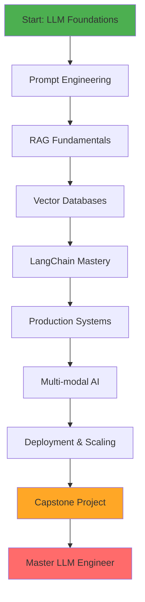

# 🚀 Master LLM Engineer Program

> **Transform from Developer to Production-Ready LLM Engineer in 10 Weeks**

[](https://opensource.org/licenses/MIT)
[](http://makeapullrequest.com)
[](https://github.com/VenkataAnilKumar/Master-LLM-Engineer/stargazers)

## 📋 Program Summary

The **Master LLM Engineer** program is an industry-ready, comprehensive training designed to transform developers into production-grade LLM engineers. This 10-week intensive curriculum covers everything from foundational LLM concepts to building and deploying enterprise-scale RAG (Retrieval Augmented Generation) systems.

### 🎯 Who Is This For?

- Software developers transitioning to AI/ML roles
- Backend engineers wanting to build LLM-powered applications
- ML engineers focusing on production LLM systems
- Tech leads architecting AI solutions
- Anyone serious about building production-grade AI applications

## 🌟 Learning Outcomes

By the end of this program, you will be able to:

### Technical Mastery
- ✅ Design and implement production-grade RAG architectures
- ✅ Build end-to-end LLM applications with LangChain and LlamaIndex
- ✅ Integrate multiple LLM providers (OpenAI, Claude, Gemini)
- ✅ Implement advanced prompt engineering and PromptOps workflows
- ✅ Work with vector databases (FAISS, Chroma, Pinecone)
- ✅ Build multi-modal AI systems (text, image, audio)
- ✅ Design scalable API architectures for LLM applications

### Production Skills
- ✅ Deploy LLM applications with proper security measures
- ✅ Implement monitoring and observability for AI systems
- ✅ Optimize embedding strategies and retrieval performance
- ✅ Handle streaming responses and async operations
- ✅ Implement proper error handling and fallback mechanisms
- ✅ Design cost-effective LLM architectures

### Portfolio Development
- ✅ 3 production-ready projects on GitHub
- ✅ Complete documentation and architecture diagrams
- ✅ Enterprise-grade capstone project
- ✅ Industry-standard code quality and best practices

## 📚 Program Structure

### Duration: 10 Weeks
- **Time Commitment:** 15-20 hours/week
- **Format:** Self-paced with structured curriculum
- **Projects:** 3 major projects + 1 capstone
- **Assessment:** Weekly quizzes + project evaluations

### 📁 Repository Structure

```
master-llm-engineer/
│
├── README.md                  # Program home and quick start
├── overview.md                # Detailed program overview
├── roadmap.md                 # Week-by-week learning roadmap
│
├── modules/                   # 7 comprehensive modules
│   ├── module-01-llm-fundamentals/
│   │   ├── notes.md           # Theory and concepts
│   │   ├── notebook.ipynb     # Interactive coding
│   │   └── exercises/         # Hands-on practice
│   ├── module-02-rag-systems/
│   ├── module-03-prompt-engineering/
│   ├── module-04-langchain-llamaindex/
│   ├── module-05-backend-llm-api/
│   ├── module-06-evaluation/
│   └── module-07-capstone/
│       ├── project-guidelines.md
│       └── datasets/
│
├── projects/                  # 3 real-world projects
│   ├── customer-support-ai-assistant/
│   ├── legal-qa-bot/
│   └── enterprise-rag-api/
│
├── system-designs/            # Architecture diagrams
│   ├── architecture-diagram.mmd
│   ├── dataflow.drawio
│   └── infra-diagram.png
│
├── deliverables/              # Assessments and certificates
│   ├── checklist.md           # Learning progress tracker
│   ├── assessment.md          # Weekly quizzes and evaluations
│   └── certificate-template.md
│
└── resources/                 # Additional learning materials
    ├── datasets/              # Sample datasets
    ├── pretrained-models/     # Model configurations
    ├── architectures/         # Reference architectures
    ├── best-practices/        # Industry best practices
    ├── templates/             # Documentation templates
    └── reference-links.md     # Curated resources
```

## 🛠️ Tools & Technologies

### Core Technologies
- **LLM Frameworks:** LangChain, LlamaIndex, Semantic Kernel
- **LLM Providers:** OpenAI GPT-4, Claude 3, Google Gemini, Open-source LLMs
- **Vector Databases:** FAISS, ChromaDB, Pinecone, Weaviate
- **Embeddings:** OpenAI, Cohere, Sentence Transformers
- **Web Frameworks:** FastAPI, Streamlit, Gradio

### Development Tools
- **Languages:** Python 3.10+, TypeScript (optional)
- **API Tools:** Postman, Thunder Client
- **Monitoring:** LangSmith, Weights & Biases, Prometheus
- **Deployment:** Docker, Kubernetes, Cloud platforms (AWS/GCP/Azure)
- **Version Control:** Git, GitHub

### Supporting Technologies
- **Data Processing:** Pandas, NumPy, Apache Spark
- **Document Processing:** PyPDF2, Unstructured, LlamaParse
- **Testing:** Pytest, DeepEval, Ragas
- **CI/CD:** GitHub Actions, Jenkins

## 📅 Weekly Curriculum Overview

### **Week 1-2: LLM Foundations & Prompt Engineering**
- LLM architecture fundamentals (Transformers, Attention)
- Tokenization and embeddings
- Prompt engineering techniques
- Temperature, top-p, and sampling strategies
- **Project 1 Start:** Advanced Prompt Engineering Toolkit

### **Week 3-4: RAG Fundamentals & Vector Databases**
- RAG architecture and design patterns
- Chunking strategies and optimization
- Embedding models comparison
- Vector database implementation (FAISS, Chroma, Pinecone)
- Semantic search and retrieval
- **Project 1 Completion**

### **Week 5-6: Advanced RAG & LangChain**
- LangChain deep dive
- Chains, agents, and tools
- Memory systems and conversation management
- Advanced RAG: Hybrid search, re-ranking
- Query transformation and routing
- **Project 2 Start:** Multi-Source RAG System

### **Week 7-8: Production Systems & Multi-modal AI**
- LlamaIndex advanced features
- Multi-modal processing (text, image, audio)
- Function calling and tool usage
- API design for LLM applications
- Streaming and async patterns
- **Project 2 Completion**

### **Week 9-10: Deployment & Capstone**
- Security best practices
- Monitoring and observability
- Cost optimization strategies
- Scaling LLM applications
- **Capstone Project:** Enterprise AI Knowledge Assistant

## 🎯 Projects

### Project 1: Advanced Prompt Engineering Toolkit
Build a comprehensive toolkit for prompt engineering with templates, evaluation metrics, and A/B testing capabilities.

**Key Features:**
- Prompt template library
- Chain-of-thought implementations
- Few-shot learning examples
- Evaluation framework

### Project 2: Multi-Source RAG System
Create a RAG system that intelligently retrieves and synthesizes information from multiple data sources.

**Key Features:**
- Multiple document type support (PDF, CSV, JSON, web)
- Hybrid search (semantic + keyword)
- Source attribution
- Query routing

### Project 3 (Capstone): Enterprise AI Knowledge Assistant
Build a production-grade AI assistant for enterprise knowledge management.

**Key Features:**
- Multi-tenant architecture
- Role-based access control
- Document ingestion pipeline
- RESTful API with FastAPI
- Web UI with Streamlit
- Monitoring dashboard
- Comprehensive documentation

## 📂 Repository Structure

```
Master-LLM-Engineer/
├── README.md
├── CURRICULUM.md                 # Detailed weekly breakdown
├── SETUP.md                      # Environment setup guide
│
├── week-01-llm-foundations/
│   ├── README.md
│   ├── lectures/
│   ├── labs/
│   ├── assignments/
│   └── quiz.md
│
├── week-02-prompt-engineering/
│   ├── README.md
│   ├── lectures/
│   ├── labs/
│   ├── assignments/
│   └── quiz.md
│
├── week-03-rag-fundamentals/
├── week-04-vector-databases/
├── week-05-advanced-rag/
├── week-06-langchain-deep-dive/
├── week-07-production-systems/
├── week-08-multimodal-ai/
├── week-09-deployment/
├── week-10-capstone/
│
├── projects/
│   ├── project-01-prompt-toolkit/
│   │   ├── README.md
│   │   ├── requirements.txt
│   │   ├── src/
│   │   ├── tests/
│   │   └── docs/
│   ├── project-02-multisource-rag/
│   └── project-03-enterprise-assistant/
│
├── resources/
│   ├── architectures/            # System architecture diagrams
│   ├── best-practices/           # Industry best practices
│   ├── checklists/               # Learning checklists
│   ├── evaluation-metrics/       # Model evaluation guides
│   ├── templates/                # Documentation templates
│   └── reading-materials/
│
├── assessments/
│   ├── weekly-quizzes/
│   ├── project-rubrics/
│   └── evaluation-framework.md
│
└── capstone/
    ├── README.md
    ├── requirements.md
    ├── architecture.md
    └── evaluation-criteria.md
```

## 🚀 Getting Started

### Prerequisites
```bash
- Python 3.10 or higher
- Git
- OpenAI API key (or alternative LLM provider)
- 8GB RAM minimum (16GB recommended)
- Basic understanding of Python and REST APIs
```

### Quick Start
```bash
# 1. Clone the repository
git clone https://github.com/VenkataAnilKumar/Master-LLM-Engineer.git
cd Master-LLM-Engineer

# 2. Create virtual environment
python -m venv venv
source venv/bin/activate  # On Windows: venv\Scripts\activate

# 3. Install dependencies
pip install -r requirements.txt

# 4. Set up environment variables
cp .env.example .env
# Edit .env and add your API keys

# 5. Verify setup
python verify_setup.py
```

### Navigation Guide

1. **Start Here:**
   - Read [overview.md](overview.md) for program details
   - Check [roadmap.md](roadmap.md) for week-by-week plan
   - Review [SETUP.md](SETUP.md) for environment setup

2. **Learning Path:**
   - Begin with [Module 01: LLM Fundamentals](modules/module-01-llm-fundamentals/)
   - Each module contains: `notes.md` (theory), `notebook.ipynb` (coding), `exercises/` (practice)
   - Complete projects in [projects/](projects/) folder

3. **Track Progress:**
   - Use [deliverables/checklist.md](deliverables/checklist.md) to track skills
   - Take weekly assessments from [deliverables/assessment.md](deliverables/assessment.md)

4. **Reference:**
   - System architecture diagrams in [system-designs/](system-designs/)
   - Best practices in [resources/best-practices/](resources/best-practices/)
   - Curated links in [resources/reference-links.md](resources/reference-links.md)

# Set up environment variables
cp .env.example .env
# Edit .env with your API keys

# Start with Week 1
cd week-01-llm-foundations
```

## 📊 Assessment Framework

### Evaluation Components
- **Weekly Quizzes (20%):** Test theoretical understanding
- **Lab Assignments (20%):** Hands-on coding exercises
- **Projects 1-2 (30%):** Mid-program projects
- **Capstone Project (30%):** Final enterprise project

### Grading Rubric
- **Code Quality:** Clean, documented, maintainable code
- **Functionality:** Feature completeness and correctness
- **Architecture:** System design and scalability
- **Documentation:** Clear README, API docs, architecture diagrams
- **Testing:** Unit tests, integration tests, evaluation metrics
- **Production-Readiness:** Error handling, monitoring, security

## 🎓 Capstone Project: Enterprise AI Knowledge Assistant

### Overview
Build a production-grade AI knowledge assistant that can be deployed in an enterprise environment.

### Core Features
1. **Document Ingestion Pipeline**
   - Support for multiple formats (PDF, DOCX, CSV, JSON, Markdown)
   - Automated chunking and embedding generation
   - Metadata extraction and tagging

2. **Advanced RAG System**
   - Hybrid search (semantic + BM25)
   - Query understanding and expansion
   - Multi-hop reasoning
   - Source attribution and citation

3. **RESTful API**
   - FastAPI backend
   - Authentication and authorization
   - Rate limiting
   - Streaming responses

4. **Web Interface**
   - Streamlit dashboard
   - Document upload interface
   - Chat interface with history
   - Admin panel

5. **Production Features**
   - Logging and monitoring
   - Error tracking
   - Performance metrics
   - Cost tracking
   - A/B testing framework

### Technical Requirements
- Docker containerization
- PostgreSQL for metadata
- Redis for caching
- Vector database of choice
- Comprehensive test suite (>80% coverage)
- CI/CD pipeline
- Complete documentation

## 📖 Documentation Standards

All projects must include:
- **README.md:** Project overview, setup, usage
- **ARCHITECTURE.md:** System design and diagrams
- **API.md:** API documentation (if applicable)
- **DEPLOYMENT.md:** Deployment instructions
- **CONTRIBUTING.md:** Contribution guidelines

## 🌐 Portfolio & GitHub Presentation

### Repository Guidelines
- Clean, organized repository structure
- Professional README with badges and screenshots
- Complete documentation
- Working demo (Loom video or live deployment)
- Comprehensive issue tracking and project board

### Profile Enhancement
- Pin your best 3 projects
- Include detailed project descriptions
- Add topics/tags for discoverability
- Maintain contribution activity
- Write technical blog posts about learnings

## 🤝 Contributing

We welcome contributions! Please see [CONTRIBUTING.md](CONTRIBUTING.md) for details.

### Ways to Contribute
- Improve documentation
- Add new examples and tutorials
- Submit bug fixes
- Share your project solutions (in a separate branch)
- Create video tutorials
- Translate content

## 📞 Support & Community

- **GitHub Discussions:** Ask questions and share insights
- **Issue Tracker:** Report bugs or request features
- **Discord Community:** [Join our Discord](#) (coming soon)
- **Office Hours:** Weekly Q&A sessions (schedule TBD)

## 📜 License

This project is licensed under the MIT License - see the [LICENSE](LICENSE) file for details.

## 🙏 Acknowledgments

- OpenAI for GPT models and embeddings
- Anthropic for Claude
- Google for Gemini
- LangChain and LlamaIndex communities
- All contributors and learners

## 🗺️ Learning Path Roadmap



## 📈 Success Metrics

Track your progress:
- [ ] Complete all 10 weeks of curriculum
- [ ] Build 3 production-ready projects
- [ ] Deploy capstone project to the cloud
- [ ] Achieve >80% on all assessments
- [ ] Create comprehensive documentation
- [ ] Build professional GitHub portfolio
- [ ] Write at least 2 technical blog posts
- [ ] Contribute to open-source LLM projects

---

<div align="center">

**Ready to become a Master LLM Engineer?**

[Get Started](week-01-llm-foundations/README.md) | [View Curriculum](CURRICULUM.md) | [Join Community](#)

**⭐ Star this repository to bookmark your journey!**

</div>
