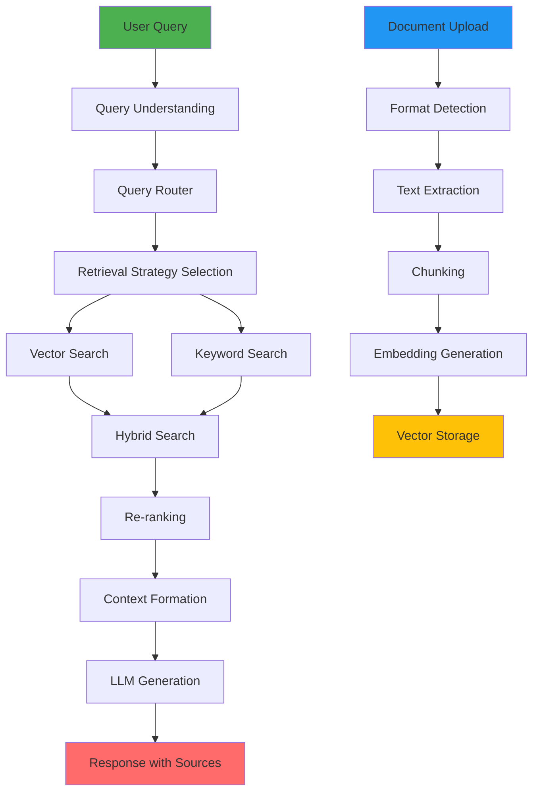

# Project 2: Multi-Source RAG System

## 🎯 Project Overview

Build a production-grade Retrieval Augmented Generation (RAG) system that intelligently retrieves and synthesizes information from multiple data sources and formats.

**Duration:** Weeks 5-8  
**Difficulty:** Intermediate to Advanced  
**Estimated Time:** 30-35 hours

## 🌟 Learning Objectives

By completing this project, you will:
- Design and implement advanced RAG architectures
- Handle multiple document types and data sources
- Implement hybrid search strategies
- Build production-ready APIs
- Master query routing and optimization
- Integrate monitoring and observability

## 🚀 Core Features

### 1. Multi-Format Document Processing (Required)
Support for various document types:
- **PDF** - Research papers, reports, books
- **DOCX** - Word documents, documentation
- **CSV/Excel** - Tabular data
- **JSON** - Structured data, API responses
- **Markdown** - Technical docs, README files
- **HTML** - Web pages, articles
- **Text** - Plain text files

**Requirements:**
- Automated format detection
- Metadata extraction (author, date, source, etc.)
- Smart chunking per format type
- Error handling for corrupted files
- Batch processing capability

### 2. Advanced RAG Pipeline (Required)
Sophisticated retrieval and generation:
- **Query Understanding**
  - Intent classification
  - Entity extraction
  - Query expansion
  - Query rewriting

- **Retrieval Strategy**
  - Semantic search (vector similarity)
  - Keyword search (BM25)
  - Hybrid search (combined)
  - MMR (Maximal Marginal Relevance)
  - Re-ranking

- **Generation**
  - Context-aware responses
  - Source attribution
  - Citation formatting
  - Multi-hop reasoning

**Requirements:**
- Configurable retrieval strategies
- Top-k and similarity threshold configuration
- Response streaming
- Source tracking and attribution

### 3. Vector Database Integration (Required)
Implement multiple vector database options:
- **FAISS** - For local/development
- **ChromaDB** - For embedded use
- **Pinecone** - For production/cloud

**Requirements:**
- Unified interface for all vector DBs
- Index management (create, update, delete)
- Efficient batch indexing
- Metadata filtering
- Hybrid search support

### 4. Query Routing & Optimization (Required)
Intelligent query handling:
- **Query Router**
  - Route to appropriate data source
  - Determine retrieval strategy
  - Select optimal LLM

- **Query Optimizer**
  - Decompose complex queries
  - Parallel retrieval
  - Caching frequent queries

**Requirements:**
- Rule-based and LLM-based routing
- Multi-query support
- Query history and caching

### 5. RESTful API (Required)
Production-ready API with FastAPI:
- **Endpoints**
  - `/ingest` - Upload and process documents
  - `/query` - Ask questions
  - `/search` - Semantic search only
  - `/health` - Health check
  - `/metrics` - Performance metrics

**Requirements:**
- Async support
- Streaming responses
- Rate limiting
- API authentication (API keys)
- OpenAPI documentation
- Error handling and validation

### 6. Monitoring & Evaluation (Required)
Track performance and quality:
- **Metrics**
  - Query latency
  - Token usage
  - Cost per query
  - Retrieval precision/recall
  - User feedback scores

- **Logging**
  - Structured logging
  - Query/response logging
  - Error tracking

**Requirements:**
- LangSmith integration (optional)
- Custom metrics dashboard
- Evaluation dataset
- Automated testing

## 🏗️ Architecture

```
multisource-rag/
├── src/
│   ├── __init__.py
│   ├── main.py                      # FastAPI application
│   ├── config.py                    # Configuration
│   ├── ingestion/
│   │   ├── __init__.py
│   │   ├── document_loader.py       # Multi-format loader
│   │   ├── text_splitter.py         # Smart chunking
│   │   └── metadata_extractor.py
│   ├── vectorstore/
│   │   ├── __init__.py
│   │   ├── base.py                  # Base interface
│   │   ├── faiss_store.py
│   │   ├── chroma_store.py
│   │   └── pinecone_store.py
│   ├── retrieval/
│   │   ├── __init__.py
│   │   ├── retriever.py             # Main retriever
│   │   ├── hybrid_search.py
│   │   ├── reranker.py
│   │   └── query_optimizer.py
│   ├── generation/
│   │   ├── __init__.py
│   │   ├── generator.py
│   │   └── prompt_templates.py
│   ├── routing/
│   │   ├── __init__.py
│   │   └── query_router.py
│   ├── api/
│   │   ├── __init__.py
│   │   ├── routes.py
│   │   ├── models.py                # Pydantic models
│   │   └── middleware.py
│   ├── monitoring/
│   │   ├── __init__.py
│   │   ├── metrics.py
│   │   └── logging_config.py
│   └── utils/
│       ├── __init__.py
│       └── helpers.py
├── tests/
│   ├── unit/
│   │   ├── test_ingestion.py
│   │   ├── test_retrieval.py
│   │   └── test_generation.py
│   ├── integration/
│   │   └── test_api.py
│   └── evaluation/
│       └── test_rag_quality.py
├── data/
│   ├── sample_docs/
│   ├── test_queries/
│   └── evaluation_set/
├── notebooks/
│   ├── 01_data_exploration.ipynb
│   ├── 02_chunking_experiments.ipynb
│   └── 03_retrieval_evaluation.ipynb
├── docs/
│   ├── ARCHITECTURE.md
│   ├── API.md
│   └── DEPLOYMENT.md
├── docker/
│   ├── Dockerfile
│   └── docker-compose.yml
├── scripts/
│   ├── ingest_data.py
│   └── benchmark.py
├── requirements.txt
├── .env.example
└── README.md
```

## 📋 Technical Requirements

### Must Have
- Python 3.10+
- FastAPI for API
- LangChain or LlamaIndex
- At least 2 vector database implementations
- Multi-format document processing
- Hybrid search implementation
- Source attribution
- API authentication
- Comprehensive tests (>75% coverage)
- Complete documentation

### Nice to Have
- Streamlit UI for testing
- Redis caching
- PostgreSQL for metadata
- Docker containerization
- CI/CD pipeline
- Load testing results
- Performance benchmarks

## 🎨 System Flow



## 📊 Example API Usage

### Document Ingestion
```python
import requests

# Upload documents
files = {
    'files': [
        open('research.pdf', 'rb'),
        open('data.csv', 'rb')
    ]
}

response = requests.post(
    'http://localhost:8000/ingest',
    files=files,
    headers={'X-API-Key': 'your-api-key'}
)

print(response.json())
# {
#   "message": "Successfully processed 2 documents",
#   "document_ids": ["doc-123", "doc-456"],
#   "chunks_created": 245
# }
```

### Querying
```python
# Ask a question
query = {
    "query": "What are the main findings about climate change?",
    "top_k": 5,
    "include_sources": True,
    "strategy": "hybrid"
}

response = requests.post(
    'http://localhost:8000/query',
    json=query,
    headers={'X-API-Key': 'your-api-key'}
)

result = response.json()
print(result['answer'])
print(result['sources'])
```

### Streaming Responses
```python
import httpx

async with httpx.AsyncClient() as client:
    async with client.stream(
        'POST',
        'http://localhost:8000/query/stream',
        json={"query": "Explain quantum computing"},
        headers={'X-API-Key': 'your-api-key'}
    ) as response:
        async for chunk in response.aiter_text():
            print(chunk, end='', flush=True)
```

## ✅ Acceptance Criteria

### Functionality
- [ ] Successfully processes all required file formats
- [ ] Hybrid search produces better results than semantic-only
- [ ] Source attribution is accurate
- [ ] API handles concurrent requests
- [ ] Streaming responses work correctly
- [ ] Error handling is robust

### Performance
- [ ] Query latency <3 seconds (p95)
- [ ] Supports 100+ documents
- [ ] Can handle 10 concurrent requests
- [ ] Retrieval precision >0.7 on test set
- [ ] Response relevance score >0.8

### Code Quality
- [ ] Modular, extensible architecture
- [ ] Type hints throughout
- [ ] Comprehensive docstrings
- [ ] Proper error handling
- [ ] Async/await where appropriate
- [ ] Configuration management

### Testing
- [ ] Unit tests for all components
- [ ] Integration tests for API
- [ ] Evaluation tests with metrics
- [ ] Test coverage >75%
- [ ] Performance benchmarks

### Documentation
- [ ] Architecture diagram
- [ ] API documentation (auto-generated + custom)
- [ ] Setup and deployment guide
- [ ] Configuration reference
- [ ] Example usage

## 🎥 Demo Requirements

Create a 5-minute video demonstrating:
1. Document ingestion (multiple formats)
2. Various query types (simple, complex, multi-hop)
3. Hybrid search comparison
4. Source attribution
5. API endpoints
6. Performance metrics

## 📈 Evaluation Rubric

| Criteria | Weight | Description |
|----------|--------|-------------|
| Feature Completeness | 30% | All required features working |
| System Architecture | 25% | Well-designed, scalable system |
| Code Quality | 20% | Clean, maintainable code |
| Documentation | 15% | Comprehensive docs |
| Performance | 10% | Meets latency/accuracy targets |

## 🚀 Getting Started

### Step 1: Project Setup
```bash
mkdir project-02-multisource-rag
cd project-02-multisource-rag

# Create virtual environment
python -m venv venv
source venv/bin/activate  # Windows: venv\Scripts\activate

# Install dependencies
pip install fastapi uvicorn langchain chromadb pypdf2 python-docx pandas
```

### Step 2: Implement Document Loader
Start with a simple document loader that handles PDFs, then expand to other formats.

### Step 3: Build Basic RAG
Implement a simple RAG pipeline with semantic search only.

### Step 4: Add Hybrid Search
Combine semantic and keyword search for better results.

### Step 5: Build API
Create FastAPI endpoints for your RAG system.

### Step 6: Add Monitoring
Implement logging and metrics collection.

### Step 7: Evaluation
Create test dataset and evaluate RAG quality.

## 🎁 Bonus Features

Extra credit for:
- [ ] Multi-modal RAG (text + images)
- [ ] Real-time document updates
- [ ] User feedback loop
- [ ] A/B testing for retrieval strategies
- [ ] Cost optimization analysis
- [ ] GraphRAG implementation
- [ ] Multi-language support
- [ ] Conversation history
- [ ] Advanced re-ranking (Cohere, etc.)
- [ ] Automated evaluation pipeline

## 📚 Resources

### Documentation
- [LangChain RAG Guide](https://python.langchain.com/docs/use_cases/question_answering/)
- [LlamaIndex Docs](https://docs.llamaindex.ai/)
- [FastAPI Documentation](https://fastapi.tiangolo.com/)

### Papers
- "Retrieval-Augmented Generation for Knowledge-Intensive NLP Tasks"
- "Dense Passage Retrieval for Open-Domain Question Answering"
- "Self-RAG: Learning to Retrieve, Generate, and Critique"

### Tools
- [RAGAs](https://github.com/explodinggradients/ragas) - RAG evaluation
- [DeepEval](https://github.com/confident-ai/deepeval) - LLM testing
- [LangSmith](https://smith.langchain.com/) - Monitoring

## 📅 Milestones

| Week | Milestone |
|------|-----------|
| 5 | Architecture designed, basic document processing |
| 6 | RAG pipeline complete, LangChain integrated |
| 7 | API built, hybrid search working |
| 8 | Monitoring added, evaluation complete, docs finished |

---

**This is your main project!** Take time to build it well.

[View Example Architecture →](examples/) (Available after Week 8)

[← Previous Project](../project-01-prompt-toolkit/README.md) | [Next Project →](../project-03-enterprise-assistant/README.md)
