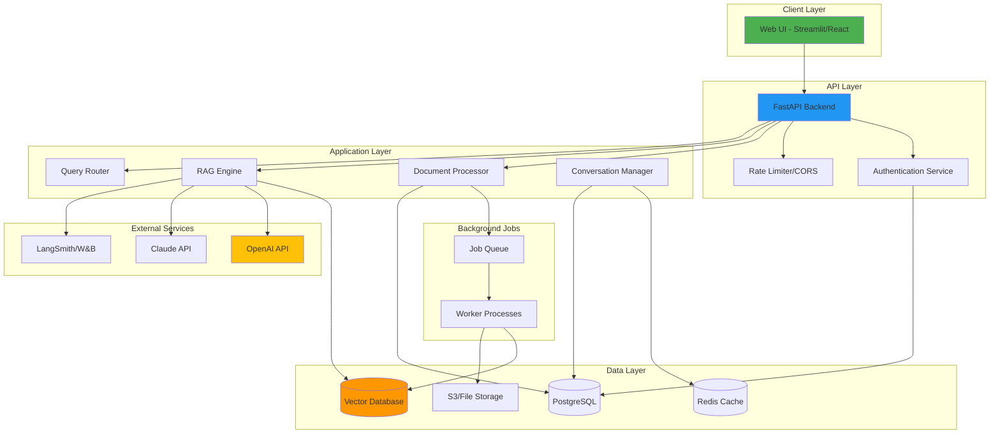

# Project 3: Enterprise AI Knowledge Assistant (Capstone)

## 🎯 Project Overview

Build a complete, production-ready enterprise AI knowledge assistant that demonstrates all skills learned throughout the program. This is your portfolio showcase project.

**Duration:** Week 10 (Intensive)  
**Difficulty:** Advanced  
**Estimated Time:** 40-50 hours

## 🌟 Project Significance

This capstone project represents:
- **Your Portfolio Centerpiece** - Showcase to potential employers
- **Full-Stack AI Application** - Frontend, backend, database, deployment
- **Production-Grade System** - Ready for real-world deployment
- **End-to-End Ownership** - Design, build, test, deploy, document

## 🚀 Required Features

### 1. Multi-Tenant Architecture
Support multiple organizations/teams:
- **Organization Management**
  - Create/manage organizations
  - Organization-specific data isolation
  - Resource quotas per organization
  
- **User Management**
  - User registration and authentication
  - Role-based access control (Admin, User, Viewer)
  - User invitations
  - Activity tracking

**Requirements:**
- JWT-based authentication
- PostgreSQL for user/org data
- Row-level security
- API rate limiting per organization

### 2. Document Management System
Complete document lifecycle:
- **Upload & Processing**
  - Drag-and-drop upload
  - Bulk upload support
  - Support formats: PDF, DOCX, TXT, MD, CSV, JSON
  - Automatic format detection
  - Progress tracking
  
- **Document Organization**
  - Folders/collections
  - Tags and categories
  - Search and filter
  - Version control
  
- **Document Metadata**
  - Auto-extracted metadata
  - Custom metadata fields
  - Ownership and permissions
  - Upload date and source

**Requirements:**
- Async document processing
- Background job queue (Celery/RQ)
- File size limits and validation
- S3 or local storage

### 3. Advanced RAG Engine
Production-grade retrieval and generation:
- **Query Processing**
  - Query understanding and expansion
  - Intent classification
  - Entity extraction
  - Query decomposition for complex questions
  
- **Retrieval Pipeline**
  - Hybrid search (semantic + keyword)
  - Multi-stage retrieval
  - Re-ranking (BM25, cross-encoder)
  - MMR for diversity
  - Metadata filtering
  
- **Generation Pipeline**
  - Context-aware generation
  - Multi-hop reasoning
  - Source attribution with page numbers
  - Citation formatting
  - Confidence scoring
  
- **Conversation Management**
  - Conversation history
  - Context window management
  - Follow-up question handling
  - Multi-turn dialogue

**Requirements:**
- Support 3+ LLM providers
- Configurable retrieval strategies
- Streaming responses
- Response caching
- Quality evaluation metrics

### 4. RESTful API
Comprehensive API for all functionality:

#### Authentication Endpoints
- `POST /api/auth/register` - User registration
- `POST /api/auth/login` - User login
- `POST /api/auth/refresh` - Refresh token
- `POST /api/auth/logout` - Logout

#### Document Endpoints
- `POST /api/documents/upload` - Upload document(s)
- `GET /api/documents` - List documents
- `GET /api/documents/{id}` - Get document details
- `DELETE /api/documents/{id}` - Delete document
- `GET /api/documents/{id}/status` - Processing status

#### Query Endpoints
- `POST /api/query` - Ask question
- `POST /api/query/stream` - Streaming response
- `GET /api/conversations` - List conversations
- `GET /api/conversations/{id}` - Get conversation history

#### Admin Endpoints
- `GET /api/admin/stats` - System statistics
- `GET /api/admin/users` - User management
- `GET /api/admin/metrics` - Performance metrics

**Requirements:**
- OpenAPI/Swagger documentation
- Request validation (Pydantic)
- Error handling and status codes
- Rate limiting
- CORS configuration
- API versioning

### 5. Web User Interface
Professional, user-friendly interface:

#### Main Dashboard
- Recent conversations
- Document library overview
- Quick stats (docs, queries, usage)
- System status

#### Chat Interface
- Clean chat UI
- Streaming responses with typing indicator
- Source citations (expandable)
- Thumbs up/down feedback
- Copy/share functionality
- Conversation history sidebar

#### Document Management
- Upload interface with drag-and-drop
- Document list with search/filter
- Document preview
- Processing status
- Bulk operations

#### Admin Panel
- User management
- System metrics dashboard
- Usage analytics
- Configuration settings
- Logs viewer

**Requirements:**
- Built with Streamlit or React
- Responsive design
- Real-time updates (WebSocket for streaming)
- Error handling and loading states
- Professional styling

### 6. Monitoring & Observability
Production-grade monitoring:

#### Metrics Collection
- Query latency (p50, p95, p99)
- Token usage (per query, per user, per org)
- Cost tracking
- Retrieval quality (precision, recall)
- User satisfaction (feedback scores)
- Error rates

#### Logging
- Structured logging (JSON)
- Log levels (DEBUG, INFO, WARNING, ERROR)
- Query/response logging
- Error tracking with stack traces
- Audit logs (user actions)

#### Alerting (Optional)
- High error rates
- Slow queries
- High costs
- System health

**Requirements:**
- Integration with LangSmith or W&B
- Custom metrics dashboard
- Log aggregation
- Performance monitoring

### 7. Testing Suite
Comprehensive testing:

#### Unit Tests
- Document processing functions
- Retrieval logic
- API endpoints
- Authentication/authorization

#### Integration Tests
- End-to-end RAG pipeline
- API workflows
- Database operations

#### Evaluation Tests
- RAG quality metrics
- Retrieval accuracy
- Generation quality
- Latency benchmarks

**Requirements:**
- Test coverage >80%
- Automated test runner
- Mock external APIs
- Test data fixtures

### 8. Deployment
Production-ready deployment:

#### Containerization
- Docker images for all services
- Docker Compose for local development
- Environment-based configuration

#### CI/CD Pipeline
- Automated testing on PR
- Linting and code quality checks
- Automated deployment
- Version tagging

#### Cloud Deployment (Choose one)
- AWS (ECS, Lambda, RDS)
- GCP (Cloud Run, Cloud SQL)
- Azure (Container Apps, Azure SQL)
- Or self-hosted

**Requirements:**
- Infrastructure as Code (optional)
- Environment variables management
- Secrets management
- Health checks
- Auto-scaling configuration (optional)

## 🏗️ System Architecture



## 📋 Technical Stack

### Backend
- **Framework:** FastAPI
- **Language:** Python 3.10+
- **LLM Framework:** LangChain or LlamaIndex
- **Database:** PostgreSQL
- **Cache:** Redis
- **Vector DB:** Pinecone, Weaviate, or Qdrant
- **Background Jobs:** Celery or RQ
- **Authentication:** JWT (python-jose)

### Frontend
- **Option 1:** Streamlit (Faster)
- **Option 2:** React + Vite (More professional)
- **Styling:** Tailwind CSS or Material-UI

### Infrastructure
- **Containerization:** Docker
- **Orchestration:** Docker Compose (local), Kubernetes (optional)
- **CI/CD:** GitHub Actions
- **Monitoring:** LangSmith, Prometheus, Grafana

### APIs & Services
- **LLMs:** OpenAI, Anthropic, Google
- **Storage:** AWS S3 or local filesystem
- **Monitoring:** LangSmith, Weights & Biases

## 📊 Database Schema

### Users Table
```sql
CREATE TABLE users (
    id UUID PRIMARY KEY,
    email VARCHAR(255) UNIQUE NOT NULL,
    hashed_password VARCHAR(255) NOT NULL,
    full_name VARCHAR(255),
    organization_id UUID,
    role VARCHAR(50),
    created_at TIMESTAMP,
    last_login TIMESTAMP
);
```

### Organizations Table
```sql
CREATE TABLE organizations (
    id UUID PRIMARY KEY,
    name VARCHAR(255) NOT NULL,
    api_key_hash VARCHAR(255),
    quota_documents INT,
    quota_queries INT,
    created_at TIMESTAMP
);
```

### Documents Table
```sql
CREATE TABLE documents (
    id UUID PRIMARY KEY,
    organization_id UUID,
    uploaded_by UUID,
    filename VARCHAR(255),
    file_path VARCHAR(500),
    file_type VARCHAR(50),
    file_size INT,
    status VARCHAR(50),
    chunks_count INT,
    metadata JSONB,
    created_at TIMESTAMP
);
```

### Conversations Table
```sql
CREATE TABLE conversations (
    id UUID PRIMARY KEY,
    user_id UUID,
    organization_id UUID,
    title VARCHAR(255),
    created_at TIMESTAMP,
    updated_at TIMESTAMP
);
```

### Messages Table
```sql
CREATE TABLE messages (
    id UUID PRIMARY KEY,
    conversation_id UUID,
    role VARCHAR(50),
    content TEXT,
    sources JSONB,
    feedback INT,
    created_at TIMESTAMP
);
```

## ✅ Acceptance Criteria

### Core Functionality (40%)
- [ ] Multi-tenant auth working correctly
- [ ] Document upload and processing works for all formats
- [ ] RAG pipeline produces accurate responses
- [ ] Source attribution is correct
- [ ] Conversation history maintained
- [ ] All API endpoints functional
- [ ] Web UI fully functional

### Production Quality (30%)
- [ ] Handles errors gracefully
- [ ] Performance meets targets (see below)
- [ ] Security best practices implemented
- [ ] Monitoring and logging in place
- [ ] Tests pass with >80% coverage

### Documentation (20%)
- [ ] Comprehensive README
- [ ] Architecture documentation
- [ ] API documentation (auto-generated)
- [ ] Deployment guide
- [ ] User guide

### Deployment (10%)
- [ ] Dockerized application
- [ ] CI/CD pipeline working
- [ ] Deployed to cloud (or deployable)
- [ ] Environment configuration documented

## 📈 Performance Targets

| Metric | Target |
|--------|--------|
| Query Latency (p95) | <3 seconds |
| Document Processing | <1 min per MB |
| Concurrent Users | 50+ |
| Uptime | 99%+ |
| Test Coverage | >80% |
| Retrieval Precision | >0.75 |
| Response Relevance | >0.85 |

## 🎥 Demo Requirements

Create a 10-minute video demonstrating:

1. **Introduction (1 min)**
   - Project overview
   - Key features

2. **User Journey (5 min)**
   - User registration/login
   - Document upload and processing
   - Ask questions and get answers
   - Source citations
   - Conversation history

3. **Admin Features (2 min)**
   - Admin dashboard
   - User management
   - Metrics and analytics

4. **Technical Deep Dive (2 min)**
   - Architecture overview
   - Key technical decisions
   - Challenges overcome

## 📈 Evaluation Rubric

| Criteria | Weight | Description |
|----------|--------|-------------|
| Feature Completeness | 25% | All required features implemented and working |
| System Architecture | 20% | Well-designed, scalable, production-ready architecture |
| Code Quality | 20% | Clean, maintainable, well-documented code |
| Documentation | 15% | Comprehensive documentation and diagrams |
| Testing | 10% | Good test coverage and quality |
| Production Readiness | 10% | Security, monitoring, deployment |

## 🚀 Week 10 Daily Plan

### Day 1: Foundation
- [ ] Set up project structure
- [ ] Configure databases (PostgreSQL, Redis, Vector DB)
- [ ] Implement authentication system
- [ ] Create database models

### Day 2: Document Processing
- [ ] Build document upload API
- [ ] Implement document processors
- [ ] Set up background job queue
- [ ] Test with various file formats

### Day 3: RAG Engine
- [ ] Implement retrieval pipeline
- [ ] Build generation pipeline
- [ ] Add conversation management
- [ ] Test RAG quality

### Day 4: API & UI
- [ ] Complete all API endpoints
- [ ] Build web UI
- [ ] Implement streaming
- [ ] Add authentication to UI

### Day 5: Advanced Features
- [ ] Add hybrid search
- [ ] Implement re-ranking
- [ ] Add admin dashboard
- [ ] Monitoring and logging

### Day 6: Testing & Documentation
- [ ] Write unit tests
- [ ] Integration tests
- [ ] Complete documentation
- [ ] Create architecture diagrams

### Day 7: Deployment & Polish
- [ ] Dockerize application
- [ ] Set up CI/CD
- [ ] Deploy to cloud
- [ ] Record demo video
- [ ] Final polish

## 🎁 Bonus Features (Extra Credit)

- [ ] Multi-language support (i18n)
- [ ] Voice input/output
- [ ] Image understanding (multi-modal RAG)
- [ ] Slack/Teams integration
- [ ] Custom LLM fine-tuning
- [ ] Advanced analytics dashboard
- [ ] Export conversations to PDF
- [ ] Collaborative features (share conversations)
- [ ] Mobile-responsive UI
- [ ] Dark mode
- [ ] Advanced admin controls
- [ ] API usage dashboard for users
- [ ] Automated report generation
- [ ] Knowledge graph visualization

## 📚 Resources

### Tutorials
- [FastAPI Full Stack](https://github.com/tiangolo/full-stack-fastapi-postgresql)
- [LangChain Production Tips](https://python.langchain.com/docs/guides/productionization/)
- [Streamlit Deployment](https://docs.streamlit.io/streamlit-community-cloud/get-started/deploy-an-app)

### Example Projects
- [Quivr](https://github.com/QuivrHQ/quivr) - Open source RAG
- [Danswer](https://github.com/danswer-ai/danswer) - Enterprise search
- [PrivateGPT](https://github.com/imartinez/privateGPT) - Private RAG

### Tools
- [LangSmith](https://smith.langchain.com/) - Monitoring
- [DeepEval](https://github.com/confident-ai/deepeval) - Testing
- [RAGAs](https://github.com/explodinggradients/ragas) - Evaluation

## 🤝 Support & Resources

- **Office Hours:** Daily during Week 10
- **GitHub Discussions:** Ask questions, share progress
- **Discord:** Real-time help
- **Code Review:** Available upon request

## 📝 Submission Checklist

- [ ] GitHub repository (public)
- [ ] Complete README with setup instructions
- [ ] Architecture diagrams
- [ ] API documentation
- [ ] Deployment guide
- [ ] Demo video (10 minutes)
- [ ] Test coverage report
- [ ] Evaluation metrics
- [ ] Live deployment URL (bonus)

## 🏆 Success Criteria

To successfully complete the capstone:
- All required features implemented (checked off)
- Performance targets met
- Test coverage >80%
- Complete documentation
- Working deployment
- Professional demo video
- Overall score >75%

---

## 🎓 After Completion

### Portfolio Presentation
- Pin this project on GitHub
- Add to LinkedIn
- Include in resume
- Share on social media

### Next Steps
- Deploy publicly
- Get user feedback
- Iterate and improve
- Consider monetizing
- Open source contributions

### Career Development
- Update resume with project
- Prepare project walkthrough for interviews
- Network in AI communities
- Apply for LLM engineer roles

---

**This is your showcase project. Make it count!**

Your capstone demonstrates everything you've learned and represents your capability as an LLM Engineer. Take pride in your work!

[View Reference Architecture →](examples/) (Available after Week 10)

[← Previous Project](../project-02-multisource-rag/README.md) | [Back to Main README](../../README.md)
