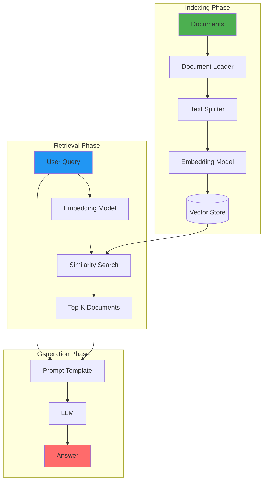
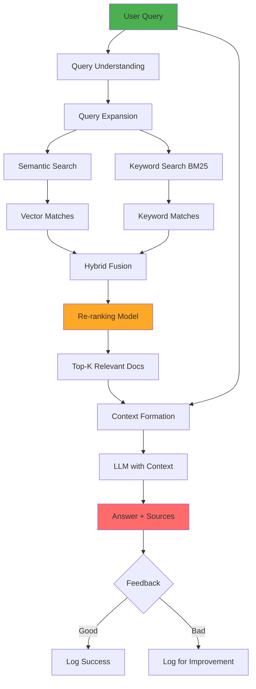
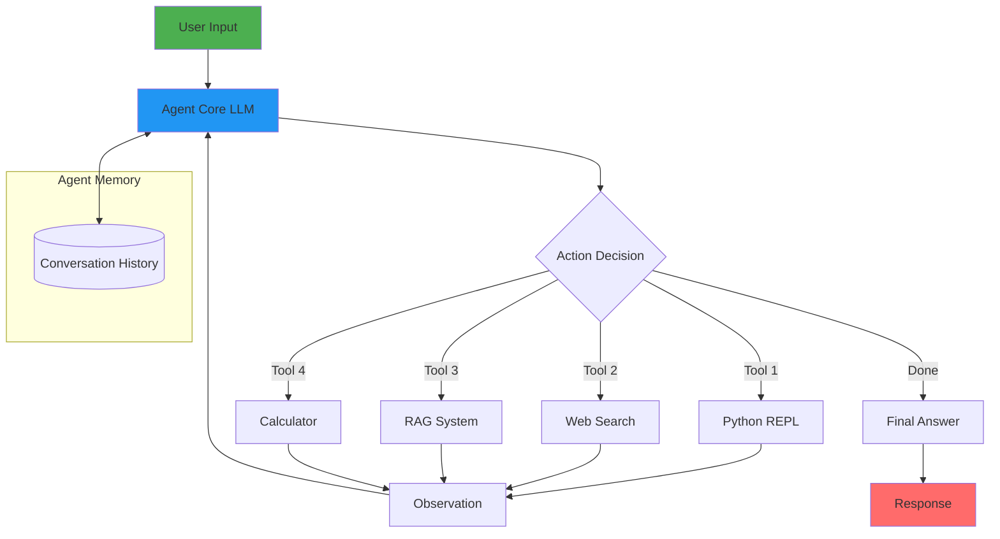
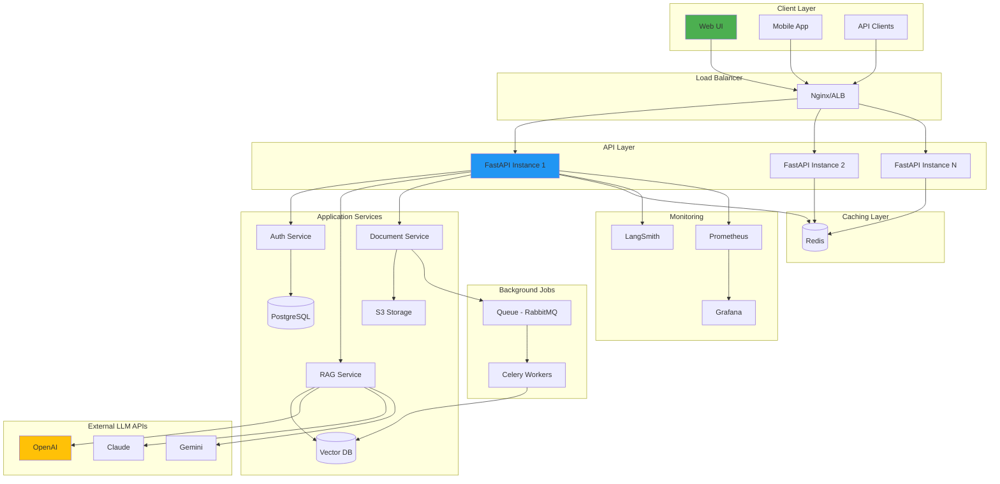
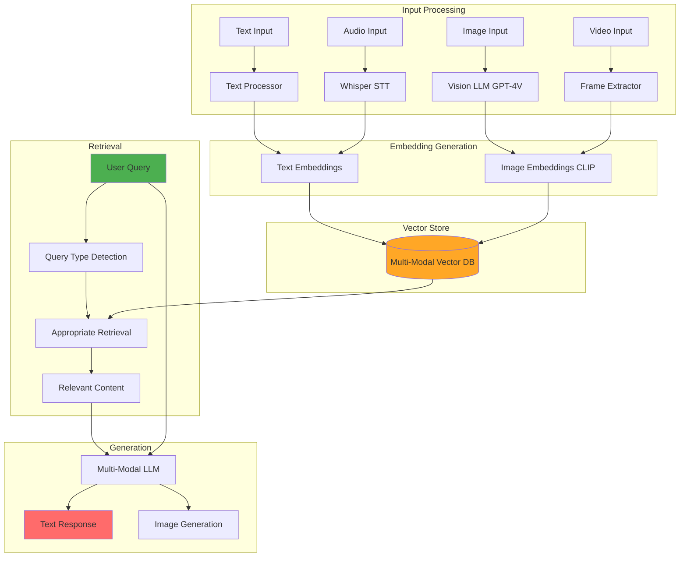
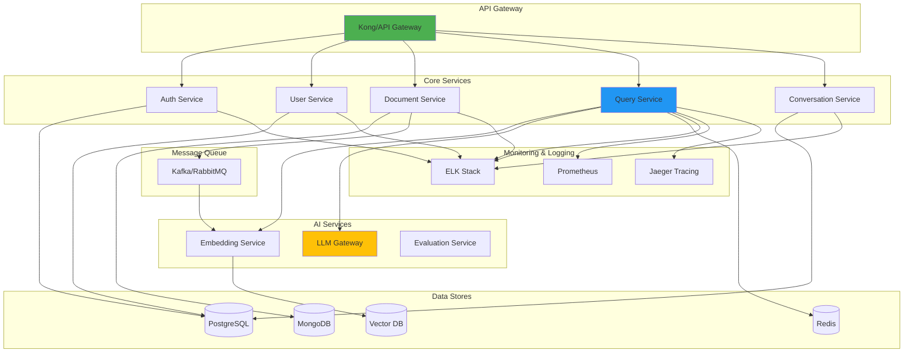
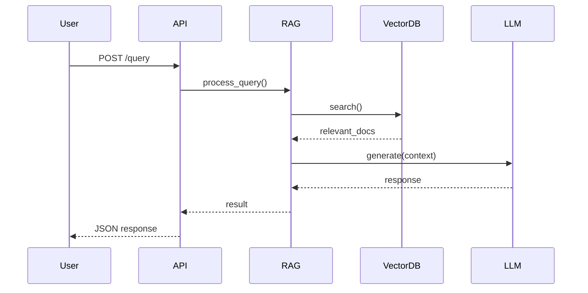
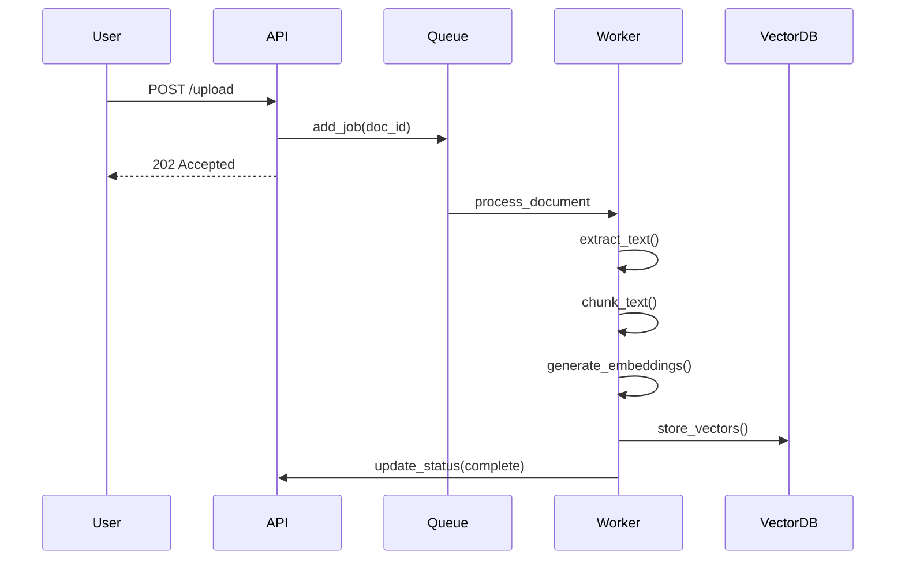
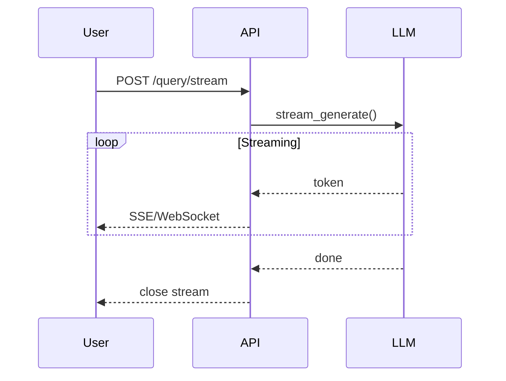

# System Architecture Diagrams

This directory contains architecture diagrams for various components and systems covered in the Master LLM Engineer program.

## Table of Contents

1. [Basic RAG Architecture](#basic-rag-architecture)
2. [Advanced RAG with Hybrid Search](#advanced-rag-with-hybrid-search)
3. [Multi-Agent System](#multi-agent-system)
4. [Production LLM Architecture](#production-llm-architecture)
5. [Multi-Modal RAG](#multi-modal-rag)
6. [Microservices Architecture](#microservices-architecture)

---

## Basic RAG Architecture

Simple RAG pipeline for document question answering.



**Use Cases:**
- Document Q&A
- Knowledge base search
- Research assistant

**Key Components:**
- Document Loader: Reads various file formats
- Text Splitter: Chunks documents intelligently
- Embedding Model: Converts text to vectors
- Vector Store: FAISS, Chroma, Pinecone
- LLM: GPT-4, Claude, Gemini

---

## Advanced RAG with Hybrid Search

Enhanced RAG with multiple retrieval strategies and re-ranking.



**Components:**
1. **Query Understanding**
   - Intent classification
   - Entity extraction
   - Query rewriting

2. **Hybrid Search**
   - Semantic: Vector similarity
   - Keyword: BM25 algorithm
   - Fusion: Reciprocal Rank Fusion

3. **Re-ranking**
   - Cross-encoder models
   - Cohere rerank
   - Custom scoring

4. **Context Formation**
   - Relevant chunk selection
   - Context window management
   - Source tracking

---

## Multi-Agent System

LangChain agent architecture with multiple tools.



**Agent Types:**
- **ReAct:** Reasoning + Acting
- **Function Calling:** Structured tool use
- **Plan-and-Execute:** Multi-step planning

**Tool Examples:**
- Python REPL: Execute code
- Web Search: DuckDuckGo, Google
- RAG: Internal knowledge base
- Calculator: Math operations
- API Calls: External services

---

## Production LLM Architecture

Full-stack production system with monitoring and scaling.



**Key Features:**
- **Horizontal Scaling:** Multiple API instances
- **Caching:** Redis for frequent queries
- **Async Processing:** Background jobs for heavy tasks
- **Monitoring:** Full observability stack
- **Security:** Authentication, rate limiting
- **High Availability:** Load balancing, redundancy

---

## Multi-Modal RAG

RAG system supporting text, images, and audio.



**Capabilities:**
- **Text:** Traditional RAG
- **Images:** Visual question answering
- **Audio:** Transcription and understanding
- **Video:** Frame analysis and summarization

**Models:**
- GPT-4V (Vision)
- Claude 3 (Multi-modal)
- CLIP (Image embeddings)
- Whisper (Speech-to-text)
- DALL-E (Image generation)

---

## Microservices Architecture

Enterprise-scale microservices for LLM applications.



**Service Responsibilities:**
- **Auth Service:** JWT, OAuth, permissions
- **User Service:** User management, profiles
- **Document Service:** Upload, processing, storage
- **Query Service:** RAG orchestration
- **Conversation Service:** Chat history, context
- **Embedding Service:** Vector generation
- **LLM Gateway:** Multi-provider routing
- **Evaluation Service:** Quality metrics

---

## Data Flow Patterns

### 1. Synchronous Query Flow


### 2. Async Document Processing


### 3. Streaming Response


---

## Design Patterns

### Repository Pattern
```python
class VectorStoreRepository(ABC):
    @abstractmethod
    def add_documents(self, docs: List[Document]) -> List[str]:
        pass
    
    @abstractmethod
    def similarity_search(self, query: str, k: int) -> List[Document]:
        pass

class FAISSRepository(VectorStoreRepository):
    # Implementation
    pass

class PineconeRepository(VectorStoreRepository):
    # Implementation
    pass
```

### Factory Pattern
```python
class LLMFactory:
    @staticmethod
    def create_llm(provider: str, **kwargs) -> BaseLLM:
        if provider == "openai":
            return OpenAILLM(**kwargs)
        elif provider == "anthropic":
            return AnthropicLLM(**kwargs)
        elif provider == "google":
            return GoogleLLM(**kwargs)
        raise ValueError(f"Unknown provider: {provider}")
```

### Strategy Pattern
```python
class RetrievalStrategy(ABC):
    @abstractmethod
    def retrieve(self, query: str) -> List[Document]:
        pass

class SemanticRetrieval(RetrievalStrategy):
    # Vector similarity
    pass

class HybridRetrieval(RetrievalStrategy):
    # Semantic + Keyword
    pass
```

---

## Best Practices

### 1. Scalability
- Use async/await for I/O operations
- Implement caching for frequent queries
- Batch process embeddings
- Use connection pooling

### 2. Reliability
- Implement retry logic with exponential backoff
- Use circuit breakers for external APIs
- Health checks for all services
- Graceful degradation

### 3. Security
- API key rotation
- Rate limiting per user/org
- Input validation and sanitization
- Encrypt sensitive data at rest

### 4. Monitoring
- Log all LLM calls with context
- Track token usage and costs
- Monitor latency percentiles
- Set up alerts for anomalies

---

## Tools for Creating Diagrams

- **Mermaid:** Markdown-based diagrams (used here)
- **Draw.io:** Visual diagram editor
- **Lucidchart:** Professional diagramming
- **PlantUML:** Code-based UML diagrams
- **Excalidraw:** Hand-drawn style diagrams

---

[← Back to Resources](../README.md)
