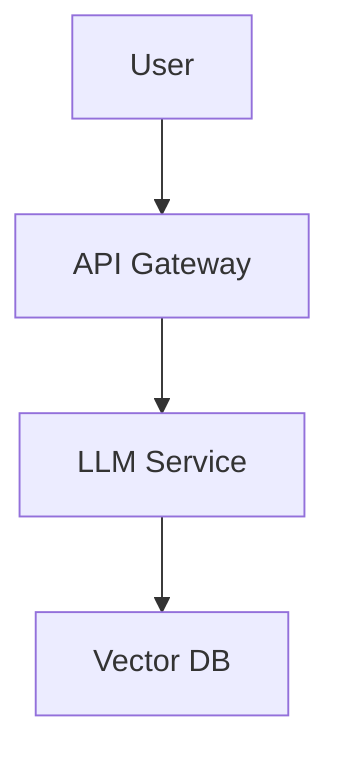

# System Architecture Diagrams

This folder contains system architecture diagrams for LLM applications covered in the Master LLM Engineer program.

---

## 📐 Available Diagrams

1. **architecture-diagram.mmd** - Comprehensive RAG system architecture (Mermaid)
2. **dataflow.drawio** - Data flow through LLM pipeline (Draw.io format)
3. **infra-diagram.png** - Infrastructure and deployment architecture

---

## 1. RAG System Architecture (Mermaid)

See [architecture-diagram.mmd](architecture-diagram.mmd) for the complete Mermaid diagram.

**Components:**
- Document Ingestion Pipeline
- Vector Store (Pinecone/Weaviate)
- Retrieval Engine (Hybrid Search)
- LLM Generation Layer
- API Gateway
- Frontend Interface

**Key Features:**
- Microservices architecture
- Async processing
- Caching layer
- Monitoring and logging

---

## 2. Data Flow Diagram

See [dataflow.drawio](dataflow.drawio) - Open with [draw.io](https://draw.io)

**Flow Stages:**
1. User Query → API Gateway
2. Query Preprocessing → Embedding
3. Vector Search → Top-K Retrieval
4. Context Assembly → LLM Prompt
5. LLM Generation → Post-processing
6. Response → User + Logging

---

## 3. Infrastructure Diagram

See [infra-diagram.png](infra-diagram.png)

**Components:**
- **Frontend**: Streamlit (Port 8501)
- **Backend API**: FastAPI (Port 8000)
- **Vector DB**: Pinecone (Cloud)
- **Cache**: Redis (Port 6379)
- **Database**: PostgreSQL (Port 5432)
- **Monitoring**: Prometheus + Grafana
- **Message Queue**: RabbitMQ/Celery

**Deployment:**
- Docker containers
- Kubernetes cluster
- Load balancer
- Auto-scaling

---

## 🔧 How to Use These Diagrams

### For Learning:
- Study each component and its role
- Understand data flow and interactions
- Identify potential bottlenecks
- Learn scaling strategies

### For Your Projects:
- Use as templates for your architectures
- Adapt to your specific requirements
- Add/remove components as needed
- Document your design decisions

### For Interviews:
- Whiteboard architecture discussions
- Explain trade-offs and decisions
- Demonstrate system thinking
- Show production-ready knowledge

---

## 🎨 Creating Your Own Diagrams

### Mermaid (Recommended)

**Tools:**
- [Mermaid Live Editor](https://mermaid.live/)
- GitHub (renders .mmd files)
- VS Code extensions

### Draw.io
- [draw.io](https://app.diagrams.net/)
- Desktop app available
- Export to PNG/SVG/PDF

### Other Tools
- **Lucidchart**: Professional diagrams
- **Figma**: UI/UX focused
- **Excalidraw**: Hand-drawn style
- **PlantUML**: Code-based diagrams

---

## 📚 Additional Resources

### Architecture Patterns:
- [AWS Architecture Center](https://aws.amazon.com/architecture/)
- [Google Cloud Architecture](https://cloud.google.com/architecture)
- [Azure Architecture](https://learn.microsoft.com/en-us/azure/architecture/)

### LLM-Specific:
- [LangChain Architecture](https://python.langchain.com/docs/modules/)
- [Pinecone Architectures](https://www.pinecone.io/learn/)
- [RAG Reference Architectures](https://docs.llamaindex.ai/en/stable/)

---

## 🔄 Updates

These diagrams are continuously updated to reflect:
- Latest architectural patterns
- New tools and services
- Community feedback
- Real-world implementations

---

**Questions?** Open an issue or discussion!
